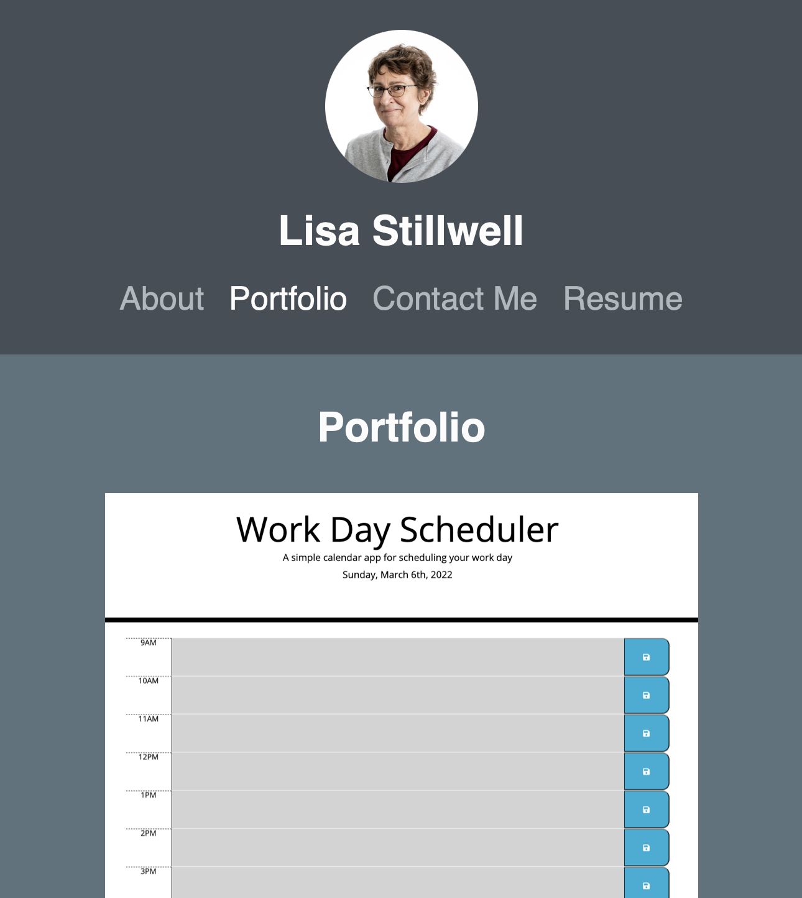

# My Portfolio - REACT Skills

## Table of Contents
1. [Description](#description)
2. [Screenshot](#screenshot)
3. [Deployment](#deployment)
4. [License](#license)
5. [Questions](#questions)

## Description
This repository contains a REACT built version of my portfolio. I hope to continually update this repo with updates of projects I work on and new skills I learn. This portfolio site is meant to demonstrate skills using REACT components and hooks to create a responsive one page website that appears to be composed of several pages. It dislpays About, Portfolio, Contact, and Resume sections.

## Screenshot

## Deployment
This portfolio is deployed [HERE](http://lstillwe.github.io/my-portfolio)

## Questions
You can find me [HERE](https://github.com/lstillwe) on Github.

You can email me at lisastillwell@bellsouth.net if you have any additional questions.